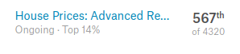
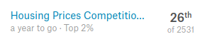

# House price predict in Kaggle Competition
- - -
https://www.kaggle.com/c/house-prices-advanced-regression-techniques (Advanced Regression Class) 
https://www.kaggle.com/c/home-data-for-ml-course (Class for Learn Users) 

 Kaggle에서 주관하는 competition 중 보스톤 주택 가격 데이터를 활용하여 test set의 가격을 예측하는 문제입니다. Advanced Regression Class 에서는 약 상위 14%, Class for Learn Users 에서는 상위 2%의 grade를 받았습니다.
 
 ## Abstarct
 Boston Housing dataset을 활용하여 각 주택의 최종 가격을 예측해야 합니다. 주택의 거의 모든 부분을 설명해주는 79가지 변수를 활용해 데이터를 분석하고, 모델을 만들어 예측을 해야합니다. 데이터 분석, 마이닝, 전처리부터 모델 선택, 학습 및 예측까지 모든 코드를 담고 있습니다. 코드는 전부 python으로 작성되었습니다.
 
 ## Data analysis, mining, preprocessing
 - 데이터 시각화 및 분석
 - null value 확인 및 fill
 - outlier 처리
 - data normalization
 - One-Hot-Encoding을 통한 cateorical feature -> dummy variable
 
> 데이터를 읽고 전반적인 데이터 전처리 과정은 predict_data.ipynb 파일에 작성하였습니다.
 
 
 ## Modeling
  학습에 사용된 모델은 아래와 같습니다.
 1. MLP(hidden layer 1개, tensorflow)
 - DNN(hidden layer 2개, tensorflow)
 - DNN(keras)
 - Randomforest
 - XGBoost
 - LightGBM
 - Lasso
 - ElasticNet
 
모델의 정의, 학습, 검증을 진행하고 ensemble 기법을 사용하여 최종적으로 train 하고 5가지 model을 선정해 평균값으로 결과를 도출했습니다. 중간의 검증과정에서는 단순 데이터 분리를 하여 검증을 해보고, k-fold cross validation을 사용하여 검증 또한 진행하여 가장 cost가 적은 모델을 선정했습니다.
> modeling 및 learn 과정은 predict_learn.ipynb 파일에 작성하였습니다.
